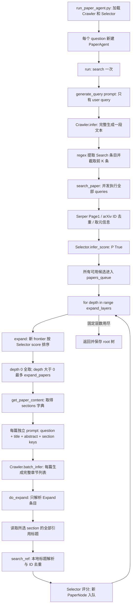

# PaSa 当前 inference 调用链与 observation 边界

审计对象：`/home/chenyi/pasa`，commit `fe89b48`。只读源码追踪；没有启动模型、调用 Serper 或运行新实验。行号对应本次审计冻结文件，SHA-256 见 `initial_source_hashes.json`。

## 真实控制流

图中的 `T → K` 是 Python 的固定 `for` 循环，没有回到 `search()` 的边。它不表示模型自主决定“再跑一层”。批内论文独立生成，没有前一篇执行结果回灌到后一篇 prompt 的机制。

## 函数级证据

| 阶段 | 源码 | 读取/输出 | 谁决定下一步 |
|---|---|---|---|
| 入口 | [run_paper_agent.py:29](/home/chenyi/pasa/run_paper_agent.py:29)，29–67 行 | 两个 Agent、参数、query、source 日期减 7 天；GT 只放 root.extra.answer | 脚本按输入行迭代 |
| 顶层 | [PaperAgent.run:234](/home/chenyi/pasa/paper_agent.py:234) | 一次 search，然后固定层数 expand | Python；无 action dispatcher、Finish 或 Stop 分支 |
| 搜索生成 | [search:132](/home/chenyi/pasa/paper_agent.py:132) | query-only prompt → 完整字符串 → 前 K 个 Search payload | 模型选文本/输出数量，代码选执行类型与上限 |
| Crawler 单次生成 | [Agent.infer:47](/home/chenyi/pasa/models.py:47)，47–72 行 | 单 user message，经 chat template 调用 generate，max_new_tokens=512 | generate 结束后才执行工具；没有 tool callback |
| 搜索执行 | [search_paper:94](/home/chenyi/pasa/paper_agent.py:94)，94–130 行 | 每条 query → IDs → metadata → Selector → node | Python 并发；`queries.pop()` 不保证按原生成顺序执行 |
| 搜索源 | [google_search_arxiv_id:44](/home/chenyi/pasa/utils.py:44)，44–81 行 | num、before、site 限制；page 固定 1；仅返回去重 ID | SERP 的排名、snippet、完整 response 未进入 Crawler |
| 元信息 | [search_paper_by_arxiv_id:305](/home/chenyi/pasa/utils.py:305)，305–351 行 | 本地 paper DB 优先，否则 arXiv API；返回 title/abstract/sections | 数据获取工具，不是模型动作决策 |
| Selector | [infer_score:28](/home/chenyi/pasa/models.py:28)，28–45 行 | query+title+abstract → 单步 logits → True 的全词表 softmax 概率 | >0.5 决定 selected；不等于 True/False 两项归一化 |
| frontier 调度 | [expand:223](/home/chenyi/pasa/paper_agent.py:223)，223–232 行 | 取 `papers_queue[expand_start:]`，按 score 排序，第一层不截断，其后最多20 | Python 选择处理哪些论文；没有 value model 调度 |
| 论文输入构造 | [get_paper_content:138](/home/chenyi/pasa/paper_agent.py:138)，138–156 行 | 缺 sections 时工具拉取；模型仅见 question/title/abstract/keys | 输入不含完整正文、引用列表、Selector score 或 queue |
| Crawler 批量生成 | [batch_infer:74](/home/chenyi/pasa/models.py:74)，74–102 行 | 独立 user message，batch_size=8，每条最多512个新 token | 一批完整生成结束后才调用 do_expand |
| 引用展开 | [do_expand:181](/home/chenyi/pasa/paper_agent.py:181)，181–221 行 | regex 取 Expand 字段，exact section key 检查，枚举 refs | Search/Stop/其他文本不派发 |
| 引用解析 | [search_ref:158](/home/chenyi/pasa/paper_agent.py:158)，158–179 行；[search_paper_by_title:658](/home/chenyi/pasa/utils.py:658)，658–680 行 | 本地唯一标题匹配；未命中/歧义返回 None；已触达 ID 跳过 | 当前 resolver 是本地复现修补，不能推成论文要求 |
| 结构与排序 | [PaperNode:14](/home/chenyi/pasa/paper_node.py:14)，14–41 行 | sections 是 section→引用标题列表；child 保存搜索/展开树；sort_paper 返回 select_score | 保存 provenance，不把整棵树发给 Crawler |

## Crawler 实际看见什么

| 时点 | 模型看见 | 运行时保存但模型看不见 |
|---|---|---|
| 初始 Search session | 用户问题、固定生成指令、当前正在生成的前缀 | 外部 Search 尚未执行；没有返回列表或收益 |
| 初始结果论文的 Expand session | 用户问题、该论文 title、abstract、sections.keys() | SERP 排名/snippet，其他论文、score、touch_ids、引用列表、调用次数 |
| 后层 Expand session | 用户问题、前层解析得到的新论文 title/abstract/section keys | 完整历史路径、前层每动作新增量、候选全集、剩余预算、失败原因 |
| Selector | 用户问题、候选 title+abstract | 它的概率被用于筛选/排序，没有作为 Crawler 输入回传 |

[Prompt 的直接证据](/home/chenyi/pasa/agent_prompt.json:2)。因此存在 `Search result → paper metadata → Expand decision` 和 `Expand result → next paper → next Expand decision` 两种跨 session 信息依赖；不存在 `Search result → 修订下一个 Search query` 的边。

## 队列的边界行为

1. `expand_start` 是已越过 frontier 的索引，不是模型生成 Stop 后移动的游标。
2. `depth=0` 处理本次 Search 找到的所有可用论文；`expand_papers=20` 从 `depth>0` 才生效，不能写成每层都20篇。
3. `expand_start=len(papers_queue)` 在扩展前设置。后续层因 Top20 截断而未处理的旧 frontier 项不会自动在下一层补回。
4. 最后一轮生成的新论文仍入队、评分、计入结果，但不会再做一次章节选择。默认 Search 节点 depth=0，后续节点 depth=1、2；root 默认 depth=-1。
5. score≤0.5 的论文仍可作为引用桥梁；不是“Selector 不相关就绝不进入 Crawler”。实际后层调度会受到相关性排序和 Top20 的限制。
6. `touch_ids` 在 Search 元信息获取成功之前登记，且 Expand 的去重锁是每个父 paper 的局部锁；不能把并发实现认定为严格、原子、全局的去重状态机。本审计不修改这些行为。

## Stop、EOS、无章节与任务结束不是同一件事

- `[Stop]` / `[StopSearch]` / `[StopExpand]`：当前 orchestration 无显式 handler。regex 只靠下一个 `[` 划定 Search/Expand payload；Stop 标记可作为最后一条的分隔符，但不驱动换 paper 或清空 context。
- EOS：checkpoint `eos_token_id=151645`，对应 `<|im_end|>`；它结束一次语言生成。512 token cap 也能终止生成。
- 无有效 Expand：该 paper 不产生新候选；可能是合理不展开，也可能是解析失败/不匹配。代码没有将这些原因可靠区分为模型 Stop。
- 全局结束：`for depth in range(expand_layers)` 走完，`run()` 返回。即使 queue 中还存在未处理论文也不会继续。

这些结论来自静态分支/调用链，不依赖任何本次试运行。论文与训练机制的对应关系见主审计报告。
